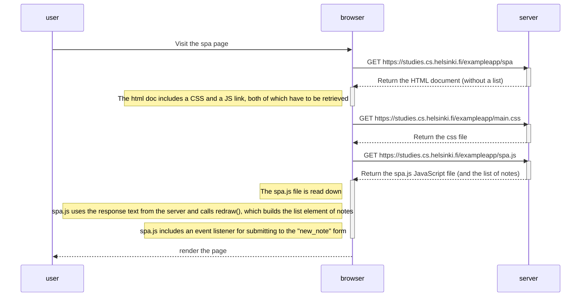

```mermaid

sequenceDiagram
    participant user
    participant browser
    participant server

    user->>browser: Visit the spa page
    browser->>server: GET https://studies.cs.helsinki.fi/exampleapp/spa
    activate server
    server-->>browser: Return the HTML document (without a list)
    deactivate server
    activate browser
    Note left of browser: The html doc includes a CSS and a JS link, both of which have to be retrieved
deactivate browser
    browser->>server: GET https://studies.cs.helsinki.fi/exampleapp/main.css
    activate server
    server-->>browser: Return the css file
    deactivate server

    browser->>server: GET https://studies.cs.helsinki.fi/exampleapp/spa.js
    activate server
    server-->>browser: Return the spa.js JavaScript file (and the list of notes)
    deactivate server

    activate browser
    Note left of browser: The spa.js file is read down
    Note left of browser: spa.js uses the response text from the server and calls redraw(), which builds the list element of notes 
    Note left of browser: spa.js includes an event listener for submitting to the "new_note" form
    deactivate browser

    browser-->>user: render the page 

```
