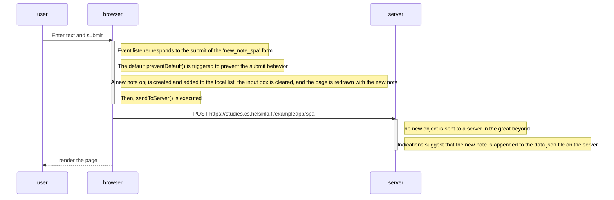

```mermaid

sequenceDiagram
    participant user
    participant browser
    participant server

    user->>browser: Enter text and submit
    activate browser
    Note right of browser: Event listener responds to the submit of the 'new_note_spa' form
    Note right of browser: The default preventDefault() is triggered to prevent the submit behavior
    Note right of browser: A new note obj is created and added to the local list, the input box is cleared, and the page is redrawn with the new note
    Note right of browser: Then, sendToServer() is executed
    deactivate browser

    browser->>server: POST https://studies.cs.helsinki.fi/exampleapp/spa 
    activate server
    Note right of server: The new object is sent to a server in the great beyond
    Note right of server: Indications suggest that the new note is appended to the data.json file on the server

    deactivate server


    browser-->>user: render the page 

```
