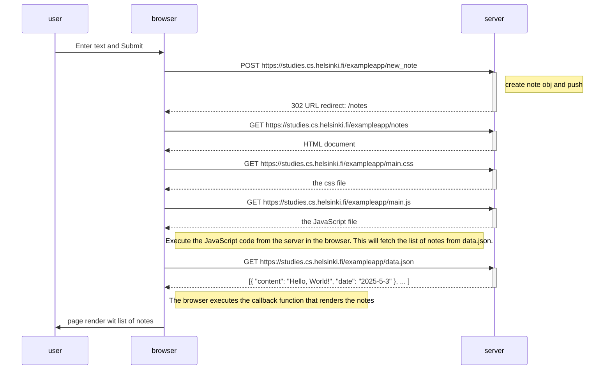

```mermaid

sequenceDiagram
    participant user
    participant browser
    participant server

    user->>browser: Enter text and Submit
    browser->>server: POST https://studies.cs.helsinki.fi/exampleapp/new_note
    activate server
    Note right of server: create note obj and push
    server-->>browser: 302 URL redirect: /notes
    deactivate server

    browser->>server: GET https://studies.cs.helsinki.fi/exampleapp/notes
    activate server
    server-->>browser: HTML document
    deactivate server

    browser->>server: GET https://studies.cs.helsinki.fi/exampleapp/main.css
    activate server
    server-->>browser: the css file
    deactivate server

    browser->>server: GET https://studies.cs.helsinki.fi/exampleapp/main.js
    activate server
    server-->>browser: the JavaScript file
    deactivate server

    Note right of browser: Execute the JavaScript code from the server in the browser. This will fetch the list of notes from data.json.

    browser->>server: GET https://studies.cs.helsinki.fi/exampleapp/data.json
    activate server
    server-->>browser: [{ "content": "Hello, World!", "date": "2025-5-3" }, ... ]
    deactivate server

    Note right of browser: The browser executes the callback function that renders the notes
    browser->>user: page render wit list of notes
```

